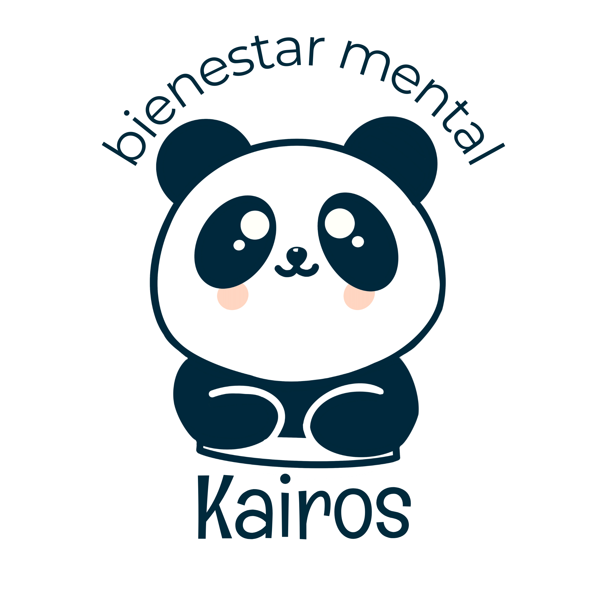

<!--

**Here are some ideas to get you started:**

🙋‍♀️ A short introduction - what is your organization all about?
🌈 Contribution guidelines - how can the community get involved?
👩‍💻 Useful resources - where can the community find your docs? Is there anything else the community should know?
🍿 Fun facts - what does your team eat for breakfast?
🧙 Remember, you can do mighty things with the power of [Markdown](https://docs.github.com/github/writing-on-github/getting-started-with-writing-and-formatting-on-github/basic-writing-and-formatting-syntax)
-->
# Kairos

Aquí llevamos el control y desarollo de los productos que ofrecemos en KAIROS para más información visita [nuestra página](https://bienestarkairos.com).

    

[Kairos](bienestarkairos.com) _by_ [Siatsa](siatsa.com). Somos una empresa enfocada en la salud mental de nuestros __clientes__ e __instituciones__.

## Proyectos

### Escanor Bienestar KAIROS

[Escanor-Bienestar KAIROS](https://github.com/BIENESTAR-KAIROS/escanor-bienestarkairos) es el repo donde manejamos el backend de nuestra aplicación.

Está montado en NestJS usando typescript para mantener un _Type Driven Development_.

## ¿Porqué KAIROS?

___Kairós___ es una palabra griega que significa "momento oportuno" o "tiempo adecuado". Es un concepto filosófico que se refiere a un lapso de tiempo en el que sucede algo importante.

Y es por ello que con nuestros servicios queremos lograr ayudar de manera oportuna a nuestros clientes en temas de salud mental.
